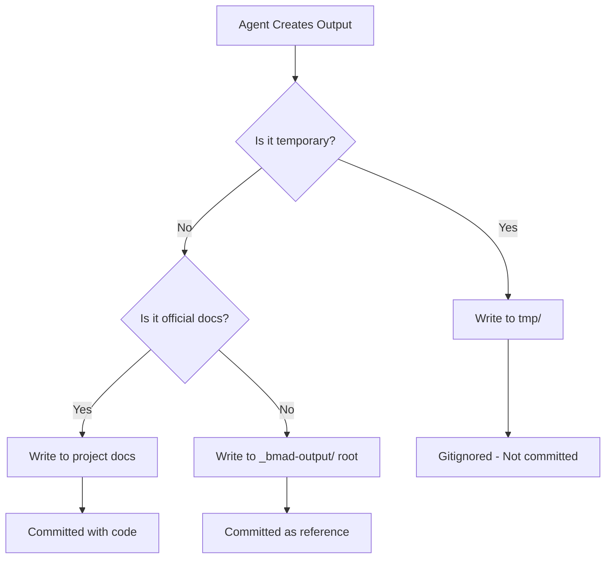

# BMad Output Organization Rules

**Version:** 1.0.0  
**Last Updated:** 2026-01-25  
**Applies To:** All BMad agents

---

## 🎯 Purpose

This document defines where BMad agents should place their output files to maintain a clean, organized codebase with proper version control.

---

## 📁 Directory Structure

```
{project-root}/
└── _bmad-output/
    ├── README.md                    # User-facing guidelines (committed)
    ├── analysis/                    # Phase 1: Analysis (committed)
    │   ├── brainstorming/
    │   ├── research/
    │   └── product-briefs/
    ├── planning-artifacts/          # Phase 2: Planning (committed)
    │   ├── bmm-workflow-status.yaml # BMM progress tracking
    │   ├── ux-design-specification.md
    │   └── prd.md
    ├── implementation-artifacts/    # Phase 4: Implementation (committed)
    │   ├── sprint-plans/
    │   └── technical-docs/
    └── tmp/                         # Temporary outputs (gitignored)
        ├── *.md                    # Session reports, summaries
        ├── analysis/               # Temporary analysis work
        ├── implementation-artifacts/  # Temporary implementation work
        └── planning-artifacts/     # Temporary planning work
```

---

## 🚨 Critical Rules (MUST Follow)

### Rule 1: Temporary Outputs → `tmp/`

**ALL of the following MUST go in `{output_folder}/tmp/`:**

- ✅ Session summaries and progress reports
- ✅ Verification reports (e.g., "VERIFICATION-TOKENS-\*.md")
- ✅ Alignment reports (e.g., "DESIGN-SYSTEM-ALIGNMENT-REPORT.md")
- ✅ Implementation summaries (e.g., "MULTI-MODE-IMPLEMENTATION-SUMMARY.md")
- ✅ Analysis artifacts
- ✅ Planning session outputs
- ✅ Work-in-progress documentation
- ✅ Debug outputs and diagnostic files

**Why:** These files document the _work process_, not the final result. They become outdated as implementation progresses.

### Rule 2: Phase Artifacts → Phase Directories (Committed)

**BMM methodology outputs go in phase-specific directories:**

- ✅ **Phase 1: `analysis/`** - Brainstorming, research, product briefs
- ✅ **Phase 2: `planning-artifacts/`** - PRDs, UX specs, workflow status
- ✅ **Phase 3: `solutioning-artifacts/`** (if created) - Architecture, epics/stories
- ✅ **Phase 4: `implementation-artifacts/`** - Sprint plans, technical docs

**Why:** These track the _permanent artifacts_ from each BMM phase that the team needs to reference.

**Special Files:**

- `planning-artifacts/bmm-workflow-status.yaml` - Tracks progress through all phases
- Phase artifacts are committed and versioned

### Rule 3: Official Documentation → Project Docs

**Final, polished documentation MUST go in official project locations:**

- ✅ Architecture decisions → `packages/design-system/_docs/brainstorming/`
- ✅ User guides → `packages/*/README.md` or `_docs/`
- ✅ API documentation → Package-specific docs

**Why:** Official documentation should be with the code it documents, not in `_bmad-output/`

---

## 📋 Decision Matrix

| Output Type              | Location                        | Committed? | Example                                           |
| ------------------------ | ------------------------------- | ---------- | ------------------------------------------------- |
| Session report           | `tmp/`                          | ❌ No      | `SESSION-CONTINUATION-SUMMARY-*.md`               |
| Verification report      | `tmp/`                          | ❌ No      | `VERIFICATION-TOKENS-*.md`                        |
| Alignment report         | `tmp/`                          | ❌ No      | `DESIGN-SYSTEM-ALIGNMENT-REPORT.md`               |
| **BMM workflow status**  | **`planning-artifacts/`**       | **✅ Yes** | **`planning-artifacts/bmm-workflow-status.yaml`** |
| **Brainstorming output** | **`analysis/`**                 | **✅ Yes** | **`analysis/brainstorming-session-*.md`**         |
| **Sprint tracking**      | **`implementation-artifacts/`** | **✅ Yes** | **`implementation-artifacts/sprint-*.yaml`**      |
| Architecture decisions   | Official docs                   | ✅ Yes     | `_docs/brainstorming/architecture-decisions.md`   |
| User guides              | Official docs                   | ✅ Yes     | `_docs/theme-switching-guide.md`                  |
| Guidelines               | `_bmad-output/` root            | ✅ Yes     | `_bmad-output/README.md`                          |

---

## 🔄 File Lifecycle



---

## 💻 Implementation for Agents

### When Writing Files

```typescript
// ❌ WRONG - Don't do this
const outputPath = `${config.output_folder}/my-report.md`;

// ✅ CORRECT - Temporary reports go in tmp/
const outputPath = `${config.output_folder}/tmp/my-report-${date}.md`;
```

### Check Before Writing

```typescript
function getOutputPath(filename: string, isTemporary: boolean = true): string {
  const baseFolder = config.output_folder;

  if (isTemporary) {
    return `${baseFolder}/tmp/${filename}`;
  }

  // For permanent files, ask user or follow strict rules
  return `${baseFolder}/${filename}`;
}
```

### Example Usage

```typescript
// Session summary - temporary
writeFile(getOutputPath(`SESSION-SUMMARY-${date}.md`, true), content);

// Verification report - temporary
writeFile(getOutputPath(`VERIFICATION-TOKENS-${date}.md`, true), content);

// Official documentation - use project docs
writeFile(`${projectRoot}/packages/design-system/_docs/theme-guide.md`, content);
```

---

## 🧹 Cleanup Guidelines

### For Users

The `tmp/` directory can be cleaned periodically:

```bash
# Safe to delete old temporary files
rm _bmad-output/tmp/*-2026-01-*.md

# Or clean everything (local only, not committed)
rm -rf _bmad-output/tmp/*
```

### For Agents

- **DO NOT** automatically clean `tmp/` unless explicitly instructed
- Let users manage cleanup of temporary files
- Inform users when `tmp/` grows large (>100MB or >50 files)

---

## ✅ Verification Checklist

Before creating any output file, agents should verify:

- [ ] Is this file temporary? → Use `tmp/`
- [ ] Is this official documentation? → Use project docs
- [ ] Does this need version control? → Consider carefully
- [ ] When in doubt → Use `tmp/`

---

## 📚 Related Documentation

- **Git Operations Rules:** `{project-root}/_bmad/core/resources/git-operations-rules.md` 🚨
- **User Guidelines:** `{output_folder}/README.md`
- **GitIgnore Rules:** `{project-root}/.gitignore` (line 65: `_bmad-output/tmp/`)
- **Config Reference:** `{project-root}/_bmad/core/config.yaml`

---

## 🔄 Version History

| Version | Date       | Changes                   |
| ------- | ---------- | ------------------------- |
| 1.0.0   | 2026-01-25 | Initial rules established |

---

**Last Updated:** 2026-01-25  
**Maintained By:** BMad Core Team  
**Questions?** See `_bmad-output/README.md` or ask BMad Master
