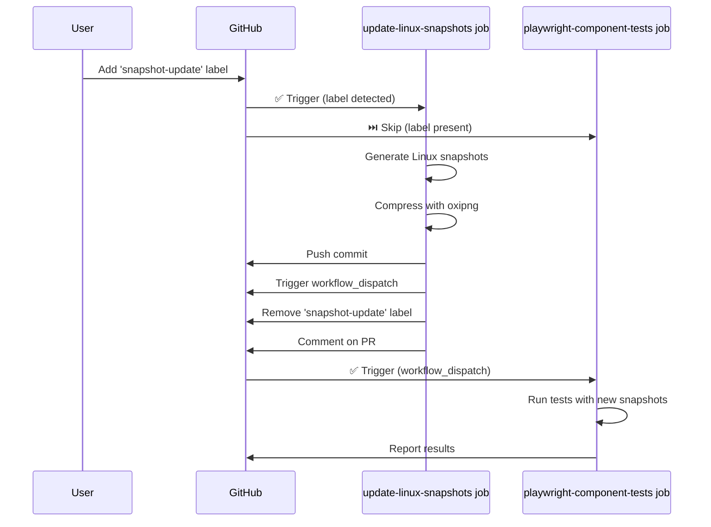

# GitHub Actions: Automated Linux Snapshot Updates

This guide explains how to use the GitHub Actions workflow to automatically update Linux Playwright snapshots via a PR label.

## Quick Start

```bash
# 1. Create your PR
gh pr create --title "Add new component"

# 2. Add the snapshot-update label
gh pr edit --add-label snapshot-update

# 3. Wait for the workflow to complete (~5-7 minutes)
# 4. Pull the changes
git pull

# 5. Merge when tests pass
```

## How It Works

### Workflow Orchestration

When you add the `snapshot-update` label to a PR, the following sequence occurs:



### Key Features

1. **Smart Job Orchestration**
   - When label is added: Test job is **skipped**, update job runs
   - After snapshots committed: Test job is **automatically triggered**
   - No race conditions or failing tests

2. **Automatic Re-triggering**
   - Uses `workflow_dispatch` to trigger tests after commit
   - Requires `actions: write` permission
   - Falls back gracefully if trigger fails

3. **Label Management**
   - Label is automatically removed after workflow completes
   - Prevents accidental re-triggers
   - Works even if workflow fails

## Detailed Workflow

### Step 1: Create Your PR

```bash
git checkout -b feature/my-component
git add .
git commit -m "feat: add new component"
git push -u origin feature/my-component
gh pr create --title "Add new component" --body "Description here"
```

### Step 2: Add the Label

**Via GitHub CLI:**

```bash
gh pr edit --add-label snapshot-update
```

**Via GitHub UI:**

1. Go to your PR page
2. Click "Labels" in the right sidebar
3. Select `snapshot-update`

### Step 3: Monitor Workflow

**Via GitHub CLI:**

```bash
# Watch workflow runs
gh run watch

# List recent runs
gh run list --workflow="Tools:Test:Playwright-CT"
```

**Via GitHub UI:**

1. Go to the "Actions" tab
2. Find the "Tools:Test:Playwright-CT" workflow
3. Look for runs with your PR number

### Step 4: Review Results

The workflow will comment on your PR with the results:

#### Success Comment:

```
✅ Linux snapshots have been updated and compressed!

**Changes:**
- Updated Linux snapshots in `packages/design-system/playwright/__snapshots__/`
- Compressed snapshots using oxipng (level 6)
- Committed with message: "test: update Linux snapshots (automated)"
- New commit SHA: `abc123...`

**Next steps:**
1. ✅ Workflow has been triggered to run tests on updated snapshots
2. Pull the latest changes: `git pull`
3. Review the snapshot changes in the "Files changed" tab
4. Merge when tests pass

_The `snapshot-update` label has been automatically removed._
```

#### No Changes Comment:

```
ℹ️ No snapshot changes detected.

The existing Linux snapshots are already up to date.

_The `snapshot-update` label has been automatically removed._
```

### Step 5: Pull Changes and Merge

```bash
# Pull the automated commit
git pull

# Review the snapshot changes
git log -1 --stat

# Merge when tests pass
gh pr merge --squash
```

## Workflow Configuration

### Triggers

The workflow runs on:

```yaml
on:
  pull_request:
    types: [opened, synchronize, reopened, labeled]
  push:
    branches:
      - main
  workflow_dispatch:
    inputs:
      pr_number:
        description: 'PR number to test'
        required: false
        type: number
```

### Jobs

#### `playwright-component-tests`

**Purpose**: Run Playwright component tests

**Runs when**:

- PR opened, synchronized, or reopened
- Push to main branch
- Workflow manually dispatched
- **SKIPS** when `snapshot-update` label is added (to avoid race condition)

**Condition**:

```yaml
if: |
  !(github.event_name == 'pull_request' && 
    github.event.action == 'labeled' && 
    github.event.label.name == 'snapshot-update')
```

#### `update-linux-snapshots`

**Purpose**: Generate and commit Linux snapshots

**Runs when**:

- PR has the `snapshot-update` label

**Condition**:

```yaml
if: github.event_name == 'pull_request' &&
  contains(github.event.pull_request.labels.*.name, 'snapshot-update')
```

**Steps**:

1. Checkout PR branch
2. Install dependencies and Playwright
3. Build design system packages
4. Run tests with `--update-snapshots`
5. Compress snapshots with oxipng
6. Commit and push changes
7. **Trigger test workflow via `workflow_dispatch`**
8. Comment on PR with results
9. Remove `snapshot-update` label

### Permissions

```yaml
permissions:
  contents: write # Push snapshot updates
  pull-requests: write # Comment on PR
  actions: write # Trigger workflow_dispatch
```

## Troubleshooting

### Issue: Workflow Doesn't Trigger

**Check**:

```bash
# Verify label exists in repository
gh label list | grep snapshot-update

# Verify workflow file is valid
gh workflow list | grep Playwright
```

**Solution**:

```bash
# Create label if missing
gh label create snapshot-update \
  --description "Trigger automated Linux snapshot updates" \
  --color "0E8A16"

# Enable workflow if disabled
gh workflow enable "Tools:Test:Playwright-CT"
```

### Issue: Tests Don't Run After Snapshot Commit

**Symptoms**: Snapshots are committed but tests don't run automatically

**Cause**: `workflow_dispatch` trigger failed or `actions: write` permission missing

**Check Logs**:

```bash
gh run list --workflow="Tools:Test:Playwright-CT" --limit 5
gh run view <run-id> --log
```

**Manual Trigger**:

```bash
# Trigger tests manually
gh workflow run "Tools:Test:Playwright-CT" --ref <your-branch>
```

### Issue: Permission Denied on Push

**Symptoms**: Workflow fails with "Permission denied" when pushing

**Cause**: Repository settings may restrict GitHub Actions from pushing

**Solution**:

1. Go to repository Settings → Actions → General
2. Under "Workflow permissions", select "Read and write permissions"
3. Check "Allow GitHub Actions to create and approve pull requests"
4. Save changes
5. Re-run the workflow

### Issue: Tests Fail on New Snapshots

**Symptoms**: Tests run but fail after snapshots are committed

**Possible Causes**:

1. **Component changed**: Snapshots don't match new component design
2. **Non-deterministic rendering**: Component renders differently each time
3. **Missing dependencies**: Component requires specific setup

**Debug Steps**:

```bash
# Pull the snapshots locally
git pull

# Run tests in UI mode to inspect
pnpm ds:test:ui

# Check specific test
pnpm ds:test -- MyComponent.spec.tsx

# Generate snapshots locally for comparison
pnpm ds:test:update-snapshots
```

### Issue: Label Not Removed

**Symptoms**: Label stays on PR after workflow completes

**Cause**: Label removal step failed (non-blocking)

**Manual Removal**:

```bash
gh pr edit --remove-label snapshot-update
```

### Issue: Workflow Runs Twice

**Symptoms**: Two workflow runs triggered when adding label

**Expected Behavior**: This is normal!

1. First run: `update-linux-snapshots` (test job skipped)
2. Second run: `playwright-component-tests` (after snapshots committed)

**Not an issue**: This is the intended behavior to ensure tests run with updated snapshots.

## Advanced Usage

### Manual Workflow Trigger

Trigger the workflow manually without a label:

```bash
gh workflow run "Tools:Test:Playwright-CT" \
  --ref your-branch \
  --field pr_number=123
```

### Check Workflow Status

```bash
# Watch live
gh run watch

# List runs for specific PR
gh pr checks <pr-number>

# View specific run
gh run view <run-id> --web
```

### Download Artifacts on Failure

```bash
# List artifacts
gh run view <run-id> --log

# Download test results
gh run download <run-id>
```

### Re-run Failed Workflow

```bash
# Re-run entire workflow
gh run rerun <run-id>

# Re-run only failed jobs
gh run rerun <run-id> --failed
```

## Workflow Comparison

### Label Method vs Docker Method vs Pre-commit

| Aspect        | Label Method       | Docker Local     | Pre-commit        |
| ------------- | ------------------ | ---------------- | ----------------- |
| **Setup**     | None               | Docker + pnpm    | oxipng            |
| **Speed**     | ~5-7 min           | ~4-6 min         | <3 seconds        |
| **Where**     | GitHub CI          | Local machine    | Local git hook    |
| **Snapshots** | Linux only         | Linux only       | Current platform  |
| **Best For**  | Team collaboration | Local debugging  | Daily development |
| **Requires**  | PR + label         | Docker installed | Git commits       |
| **Auto-runs** | On label           | Manual command   | On commit         |

**Recommendation**:

- **Daily work**: Use pre-commit hook (automatic compression)
- **Linux snapshots**: Use label method (easiest for team)
- **Debugging**: Use Docker method (local control)

## Best Practices

### 1. Add Label After Initial PR Creation

```bash
# ✅ Good: Create PR first, then add label
gh pr create
gh pr edit --add-label snapshot-update

# ❌ Bad: Create PR with label (tests will skip unnecessarily)
gh pr create --label snapshot-update
```

### 2. Don't Add Label for Every Commit

```bash
# ✅ Good: Only when you need Linux snapshots
git commit -m "feat: new component"
git push
# Later, when ready:
gh pr edit --add-label snapshot-update

# ❌ Bad: Adding label for every commit
git commit && git push && gh pr edit --add-label snapshot-update
```

### 3. Review Snapshot Changes

```bash
# Always review what changed
git pull
git log -1 --stat
git diff HEAD~1 -- packages/design-system/playwright/__snapshots__/
```

### 4. Update Local Snapshots First

```bash
# ✅ Good: Update macOS snapshots locally
pnpm ds:test:update-snapshots
git add .
git commit -m "test: update snapshots"
git push
# Then trigger Linux snapshots
gh pr edit --add-label snapshot-update

# ❌ Bad: Skipping local snapshot updates
# (Linux snapshots might not match macOS)
```

### 5. One Label Per PR Lifecycle

```bash
# ✅ Good: Add label once, let workflow complete
gh pr edit --add-label snapshot-update
# Wait for workflow...

# ❌ Bad: Repeatedly adding/removing label
gh pr edit --add-label snapshot-update
gh pr edit --remove-label snapshot-update
gh pr edit --add-label snapshot-update  # Confusing!
```

## Security Considerations

### Workflow Permissions

The workflow requires specific permissions:

- `contents: write` - Needed to push snapshot commits
- `pull-requests: write` - Needed to comment on PR
- `actions: write` - Needed to trigger follow-up workflow

These are scoped to the workflow only and don't affect repository permissions.

### Automated Commits

Commits are made by `github-actions[bot]`:

```
Author: github-actions[bot] <github-actions[bot]@users.noreply.github.com>
```

These commits are signed by GitHub and can be verified.

### Token Scope

`GITHUB_TOKEN` is automatically provided by GitHub Actions with minimal required permissions. No manual token configuration needed.

## Related Documentation

- [Snapshot Management System](./snapshot-management-system.md) - Complete overview
- [Docker Linux Snapshots](./docker-linux-snapshots.md) - Local Docker method
- [Scripts README](../scripts/README.md) - Compression scripts
- Playwright CT instructions are maintained internally

## FAQ

**Q: How long does the workflow take?**  
A: Typically 5-7 minutes total (3-4 min for snapshots + 2-3 min for tests).

**Q: Can I cancel the workflow?**  
A: Yes, use `gh run cancel <run-id>` or cancel in GitHub UI. The label will still be removed.

**Q: Will this work on forks?**  
A: Yes, but the workflow must be enabled on the fork and permissions must be set correctly.

**Q: Can I use this for multiple PRs simultaneously?**  
A: Yes, each PR's workflow runs independently.

**Q: What if I push new commits while the workflow is running?**  
A: The workflow will complete on the original commit. Add the label again if needed.

**Q: Does this use GitHub Actions minutes?**  
A: Yes, approximately 10-15 minutes per workflow run (two jobs). Check your repository's Actions usage.

**Q: Can I customize the commit message?**  
A: Currently no, but you can modify the workflow file to change it.

**Q: Why skip tests when adding the label?**  
A: To avoid race conditions. Tests would fail because snapshots don't exist yet. After snapshots are committed, tests run automatically.

**Q: What if the workflow_dispatch trigger fails?**  
A: Non-critical - tests will still run on the next push or PR sync. The workflow logs a warning but doesn't fail.

---

**Need help?** Check the [troubleshooting](#troubleshooting) section or open an issue.
