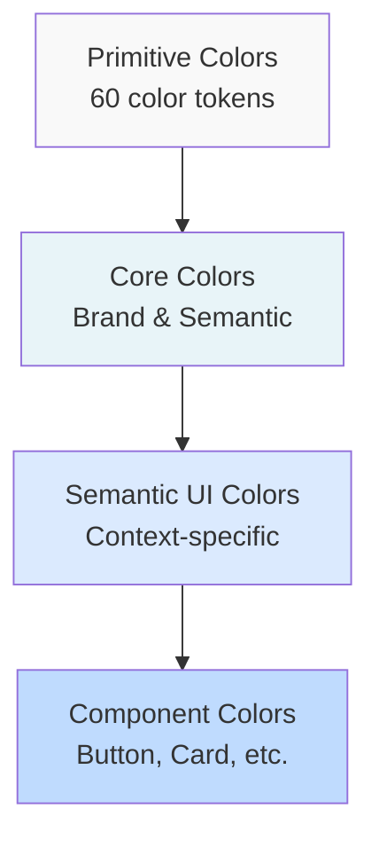

# Color System Documentation

**Lufa Design System v2.0**  
**Package**: `@grasdouble/lufa_design-system-tokens`

---

## Overview

The Lufa Design System uses a comprehensive 4-level color token architecture with 60+ primitive colors, semantic color contexts, and mode-aware color mappings for light, dark, and high-contrast modes.

---

## Color Architecture



---

## Primitive Color Scales (Level 1)

The foundation consists of 6 color palettes with 10 shades each (50-950).

### Gray Scale

```
██ 50   #f9fafb   Lightest gray - backgrounds, subtle borders
██ 100  #f3f4f6   Very light gray - hover states, disabled backgrounds
██ 200  #e5e7eb   Light gray - borders, separators
██ 300  #d1d5db   Medium-light gray - inactive elements
██ 400  #9ca3af   Medium gray - placeholders, disabled text
██ 500  #6b7280   Base gray - secondary text, icons
██ 600  #4b5563   Dark gray - primary text, headings
██ 700  #374151   Very dark gray - emphasized text
██ 800  #1f2937   Deep gray - high contrast text
██ 900  #111827   Darkest gray - maximum contrast
```

**Usage**: Neutrals, text, backgrounds, borders

**CSS Variables**:

```css
var(--lufa-primitive-color-gray-50)
var(--lufa-primitive-color-gray-100)
/* ... through gray-900 */
```

**JSON Access**:

```typescript
import tokens from '@grasdouble/lufa_design-system-tokens/dist/tokens-docs.json';

const gray500 = tokens.primitive.color.gray['500']; // "#6b7280"
```

---

### Blue Scale

```
██ 50   #eff6ff   Lightest blue
██ 100  #dbeafe   Very light blue - info backgrounds
██ 200  #bfdbfe   Light blue
██ 300  #93c5fd   Medium-light blue - info borders
██ 400  #60a5fa   Medium blue
██ 500  #3b82f6   Base blue - info state
██ 600  #2563eb   Primary brand blue
██ 700  #1d4ed8   Dark blue - hover states
██ 800  #1e40af   Very dark blue
██ 900  #1e3a8a   Darkest blue
```

**Usage**: Primary actions, links, info states

**Use Cases**:

- Primary buttons: `blue-600`
- Links: `blue-600`
- Info alerts: `blue-500` (text), `blue-100` (bg), `blue-300` (border)

---

### Green Scale

```
██ 50   #f0fdf4   Lightest green
██ 100  #dcfce7   Very light green - success backgrounds
██ 200  #bbf7d0   Light green
██ 300  #86efac   Medium-light green - success borders
██ 400  #4ade80   Medium green
██ 500  #22c55e   Base green - success state
██ 600  #16a34a   Dark green - success hover
██ 700  #15803d   Very dark green
██ 800  #166534   Deep green
██ 900  #14532d   Darkest green
```

**Usage**: Success states, positive feedback, confirmations

**Use Cases**:

- Success messages: `green-500`
- Success alerts: `green-500` (text), `green-100` (bg), `green-300` (border)
- Checkmarks: `green-600`

---

### Red Scale

```
██ 50   #fef2f2   Lightest red
██ 100  #fee2e2   Very light red - error backgrounds
██ 200  #fecaca   Light red
██ 300  #fca5a5   Medium-light red - error borders
██ 400  #f87171   Medium red
██ 500  #ef4444   Base red
██ 600  #dc2626   Error state red
██ 700  #b91c1c   Dark red - error hover, destructive actions
██ 800  #991b1b   Very dark red
██ 900  #7f1d1d   Darkest red
```

**Usage**: Error states, destructive actions, critical warnings

**Use Cases**:

- Error messages: `red-600`
- Error alerts: `red-600` (text), `red-100` (bg), `red-300` (border)
- Destructive buttons: `red-600`
- Form validation errors: `red-600`

---

### Yellow Scale

```
██ 50   #fefce8   Lightest yellow
██ 100  #fef9c3   Very light yellow - warning backgrounds
██ 200  #fef08a   Light yellow
██ 300  #fde047   Medium-light yellow - warning borders
██ 400  #facc15   Medium yellow
██ 500  #eab308   Base yellow - warning state
██ 600  #ca8a04   Dark yellow - warning hover
██ 700  #a16207   Very dark yellow
██ 800  #854d0e   Deep yellow
██ 900  #713f12   Darkest yellow
```

**Usage**: Warning states, caution messages, pending actions

**Use Cases**:

- Warning messages: `yellow-500`
- Warning alerts: `yellow-500` (text), `yellow-100` (bg), `yellow-300` (border)
- Caution badges: `yellow-600`

---

### Purple Scale

```
██ 50   #faf5ff   Lightest purple
██ 100  #f3e8ff   Very light purple
██ 200  #e9d5ff   Light purple
██ 300  #d8b4fe   Medium-light purple
██ 400  #c084fc   Medium purple
██ 500  #a855f7   Base purple - secondary brand
██ 600  #9333ea   Dark purple
██ 700  #7e22ce   Very dark purple
██ 800  #6b21a8   Deep purple
██ 900  #581c87   Darkest purple
```

**Usage**: Secondary brand color, accents, highlights

**Use Cases**:

- Secondary buttons: `purple-500`
- Accent badges: `purple-500`
- Decorative highlights: `purple-400`

---

## Core Semantic Colors (Level 2)

Core semantic colors provide named design decisions that reference primitives.

### Brand Colors

| Token                         | Light Mode   | Dark Mode    | High Contrast | Use Case                      |
| ----------------------------- | ------------ | ------------ | ------------- | ----------------------------- |
| `core.brand.primary`          | `blue-600`   | `blue-500`   | `hc.blue`     | Primary buttons, links, focus |
| `core.brand.primary-hover`    | `blue-700`   | `blue-400`   | `hc.blue`     | Primary hover state           |
| `core.brand.primary-active`   | `blue-800`   | `blue-600`   | `hc.blue`     | Primary active/pressed        |
| `core.brand.secondary`        | `purple-500` | `purple-400` | `purple-600`  | Secondary buttons, badges     |
| `core.brand.secondary-hover`  | `purple-600` | `purple-300` | `purple-700`  | Secondary hover               |
| `core.brand.secondary-active` | `purple-700` | `purple-500` | `purple-800`  | Secondary active              |

**CSS Usage**:

```css
.primary-button {
  background: var(--lufa-core-brand-primary);
}

.primary-button:hover {
  background: var(--lufa-core-brand-primary-hover);
}

.primary-button:active {
  background: var(--lufa-core-brand-primary-active);
}
```

---

### Success Colors

| Token                          | Light Mode  | Dark Mode   | High Contrast | Use Case                  |
| ------------------------------ | ----------- | ----------- | ------------- | ------------------------- |
| `core.semantic.success`        | `green-500` | `green-400` | `hc.green`    | Success text, icons       |
| `core.semantic.success-subtle` | `green-100` | `green-900` | `green-100`   | Success alert backgrounds |
| `core.semantic.success-border` | `green-300` | `green-700` | `hc.green`    | Success borders           |
| `core.semantic.success-hover`  | `green-600` | `green-300` | `hc.green`    | Success hover state       |

**Example - Success Alert**:

```css
.alert-success {
  color: var(--lufa-core-semantic-success);
  background: var(--lufa-core-semantic-success-subtle);
  border: 1px solid var(--lufa-core-semantic-success-border);
}
```

---

### Error Colors

| Token                        | Light Mode | Dark Mode | High Contrast | Use Case                |
| ---------------------------- | ---------- | --------- | ------------- | ----------------------- |
| `core.semantic.error`        | `red-600`  | `red-400` | `hc.red`      | Error text, validation  |
| `core.semantic.error-subtle` | `red-100`  | `red-900` | `red-100`     | Error alert backgrounds |
| `core.semantic.error-border` | `red-300`  | `red-700` | `hc.red`      | Error borders           |
| `core.semantic.error-hover`  | `red-700`  | `red-300` | `hc.red`      | Error hover state       |

**Example - Input Validation Error**:

```css
.input-error {
  border-color: var(--lufa-core-semantic-error);
}

.error-message {
  color: var(--lufa-core-semantic-error);
}
```

---

### Warning Colors

| Token                          | Light Mode   | Dark Mode    | High Contrast | Use Case                    |
| ------------------------------ | ------------ | ------------ | ------------- | --------------------------- |
| `core.semantic.warning`        | `yellow-500` | `yellow-400` | `hc.yellow`   | Warning text, caution icons |
| `core.semantic.warning-subtle` | `yellow-100` | `yellow-900` | `yellow-100`  | Warning backgrounds         |
| `core.semantic.warning-border` | `yellow-300` | `yellow-700` | `hc.yellow`   | Warning borders             |
| `core.semantic.warning-hover`  | `yellow-600` | `yellow-300` | `hc.yellow`   | Warning hover state         |

---

### Info Colors

| Token                       | Light Mode | Dark Mode  | High Contrast | Use Case              |
| --------------------------- | ---------- | ---------- | ------------- | --------------------- |
| `core.semantic.info`        | `blue-500` | `blue-400` | `hc.blue`     | Info text, help icons |
| `core.semantic.info-subtle` | `blue-100` | `blue-900` | `blue-100`    | Info backgrounds      |
| `core.semantic.info-border` | `blue-300` | `blue-700` | `hc.blue`     | Info borders          |
| `core.semantic.info-hover`  | `blue-600` | `blue-300` | `hc.blue`     | Info hover state      |

---

## Mode-Aware Color Mappings

Colors automatically adapt based on the active mode (light/dark/high-contrast).

### How Mode-Awareness Works

```json
{
  "core": {
    "brand": {
      "primary": {
        "$value": "{primitive.color.blue.600}",
        "$extensions": {
          "lufa": {
            "modes": {
              "light": "{primitive.color.blue.600}",
              "dark": "{primitive.color.blue.500}",
              "high-contrast": "{primitive.color.hc.blue}"
            },
            "modeAware": true
          }
        }
      }
    }
  }
}
```

### Mode Switching Example

```css
/* Light mode (default) */
:root {
  --lufa-core-brand-primary: #2563eb; /* blue-600 */
}

/* Dark mode */
[data-theme='dark'] {
  --lufa-core-brand-primary: #3b82f6; /* blue-500 - lighter for dark bg */
}

/* High contrast mode */
[data-theme='high-contrast'] {
  --lufa-core-brand-primary: #0000ff; /* Maximum contrast blue */
}
```

---

## Component Color Usage

### Button Colors

```css
/* Primary Button */
.button-primary {
  background: var(--lufa-component-button-primary-background);
  color: var(--lufa-component-button-primary-text);
}

.button-primary:hover {
  background: var(--lufa-component-button-primary-background-hover);
}

.button-primary:active {
  background: var(--lufa-component-button-primary-background-active);
}

/* Destructive Button */
.button-destructive {
  background: var(--lufa-component-button-destructive-background);
  color: var(--lufa-component-button-destructive-text);
}

.button-destructive:hover {
  background: var(--lufa-component-button-destructive-background-hover);
}
```

### Card Colors

```css
.card {
  background: var(--lufa-semantic-ui-background-default);
  border: 1px solid var(--lufa-semantic-ui-border-default);
}

.card:hover {
  border-color: var(--lufa-semantic-ui-border-hover);
}
```

---

## Color Decision Tree

**When choosing a color token, follow this decision tree:**

```
START: Need a color?
│
├─ Is it a raw value (like #ff0000)?
│  └─ YES → Use primitive color token
│     Example: primitive.color.blue.600
│
├─ Is it a brand color (primary/secondary)?
│  └─ YES → Use core brand token
│     Example: core.brand.primary
│
├─ Is it semantic (success/error/warning/info)?
│  └─ YES → Use core semantic token
│     Example: core.semantic.success
│
├─ Is it component-specific?
│  └─ YES → Use component token
│     Example: component.button.primary.background
│
└─ Is it for general UI (text, bg, border)?
   └─ YES → Use semantic UI token
      Example: semantic.ui.text.primary
```

---

## Accessibility Guidelines

### WCAG Contrast Requirements

**AA Standard (minimum)**:

- Normal text (< 18px): 4.5:1 contrast ratio
- Large text (≥ 18px or bold ≥ 14px): 3:1 contrast ratio

**AAA Standard (enhanced)**:

- Normal text: 7:1 contrast ratio
- Large text: 4.5:1 contrast ratio

### Recommended Pairings

**Light mode backgrounds**:

```css
/* gray-50 background */
--text-primary: gray-900; /* 18.8:1 AAA ✅ */
--text-secondary: gray-600; /* 7.1:1 AAA ✅ */
--text-tertiary: gray-500; /* 4.8:1 AA ✅ */
```

**Dark mode backgrounds**:

```css
/* gray-900 background */
--text-primary: gray-50; /* 18.8:1 AAA ✅ */
--text-secondary: gray-300; /* 8.2:1 AAA ✅ */
--text-tertiary: gray-400; /* 5.2:1 AA ✅ */
```

### Testing Colors

Use the metadata in tokens to verify WCAG compliance:

```json
{
  "primitive": {
    "color": {
      "gray": {
        "50": {
          "$extensions": {
            "lufa": {
              "wcagAALarge": ["gray-900", "gray-800", "gray-700"],
              "wcagAAA": ["gray-900"]
            }
          }
        }
      }
    }
  }
}
```

---

## Quick Reference

### Most Common Colors

| Use Case         | Token                            | Light Mode   | Dark Mode    |
| ---------------- | -------------------------------- | ------------ | ------------ |
| Primary action   | `core.brand.primary`             | `blue-600`   | `blue-500`   |
| Secondary action | `core.brand.secondary`           | `purple-500` | `purple-400` |
| Success          | `core.semantic.success`          | `green-500`  | `green-400`  |
| Error            | `core.semantic.error`            | `red-600`    | `red-400`    |
| Warning          | `core.semantic.warning`          | `yellow-500` | `yellow-400` |
| Info             | `core.semantic.info`             | `blue-500`   | `blue-400`   |
| Primary text     | `semantic.ui.text.primary`       | `gray-900`   | `gray-50`    |
| Secondary text   | `semantic.ui.text.secondary`     | `gray-600`   | `gray-400`   |
| Background       | `semantic.ui.background.default` | `white`      | `gray-900`   |
| Border           | `semantic.ui.border.default`     | `gray-200`   | `gray-700`   |

---

## Examples

### Alert Component

```css
/* Success Alert */
.alert-success {
  background: var(--lufa-core-semantic-success-subtle);
  border: 1px solid var(--lufa-core-semantic-success-border);
  color: var(--lufa-core-semantic-success);
  padding: var(--lufa-primitive-spacing-12);
  border-radius: var(--lufa-primitive-radius-scale-base);
}

/* Error Alert */
.alert-error {
  background: var(--lufa-core-semantic-error-subtle);
  border: 1px solid var(--lufa-core-semantic-error-border);
  color: var(--lufa-core-semantic-error);
}

/* Warning Alert */
.alert-warning {
  background: var(--lufa-core-semantic-warning-subtle);
  border: 1px solid var(--lufa-core-semantic-warning-border);
  color: var(--lufa-core-semantic-warning);
}

/* Info Alert */
.alert-info {
  background: var(--lufa-core-semantic-info-subtle);
  border: 1px solid var(--lufa-core-semantic-info-border);
  color: var(--lufa-core-semantic-info);
}
```

### Form Validation

```css
/* Valid input */
.input-valid {
  border-color: var(--lufa-core-semantic-success);
}

.input-valid:focus {
  border-color: var(--lufa-core-semantic-success-hover);
  outline: 2px solid var(--lufa-core-semantic-success-subtle);
}

/* Invalid input */
.input-invalid {
  border-color: var(--lufa-core-semantic-error);
}

.input-invalid:focus {
  border-color: var(--lufa-core-semantic-error-hover);
  outline: 2px solid var(--lufa-core-semantic-error-subtle);
}

/* Error message */
.validation-error {
  color: var(--lufa-core-semantic-error);
  font-size: var(--lufa-semantic-typography-caption);
  margin-top: var(--lufa-primitive-spacing-4);
}
```

---

**Last Updated**: February 2026  
**Version**: 2.0.0  
**Status**: ✅ Complete
