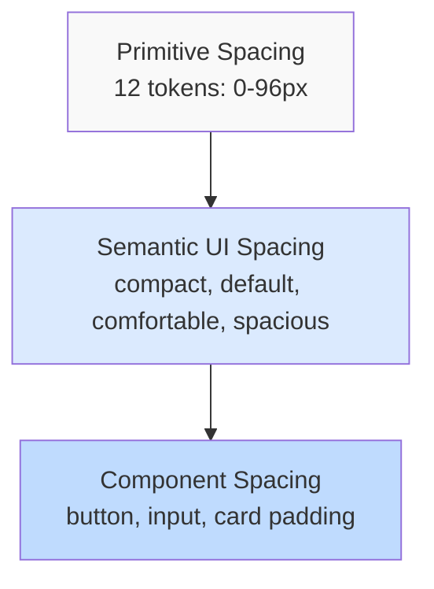

# Spacing Scale Documentation

**Lufa Design System v2.0**  
**Package**: `@grasdouble/lufa_design-system-tokens`

---

## Overview

The Lufa Design System uses a consistent 4px-based spacing scale with 12 spacing values ranging from 0px to 96px. This creates rhythm, consistency, and visual hierarchy across all components.

---

## Spacing Architecture



---

## Primitive Spacing Scale (Level 1)

The foundational spacing scale follows a 4px base unit for consistency.

### Visual Scale

```
┌─────────────────────────────────────────────────────────────────┐
│ Token      Value   Visual                        Use Case        │
├─────────────────────────────────────────────────────────────────┤
│ spacing.0    0px   ·                             Reset spacing   │
│ spacing.4    4px   ▪                             Icon-text gap   │
│ spacing.8    8px   ▪▪                            Tight spacing   │
│ spacing.12   12px  ▪▪▪                           Compact         │
│ spacing.16   16px  ▪▪▪▪                          Base/Default    │
│ spacing.24   24px  ▪▪▪▪▪▪                        Spacious        │
│ spacing.32   32px  ▪▪▪▪▪▪▪▪                      Ample           │
│ spacing.40   40px  ▪▪▪▪▪▪▪▪▪▪                    Extra ample     │
│ spacing.48   48px  ▪▪▪▪▪▪▪▪▪▪▪▪                  Very ample      │
│ spacing.64   64px  ▪▪▪▪▪▪▪▪▪▪▪▪▪▪▪▪              Large           │
│ spacing.80   80px  ▪▪▪▪▪▪▪▪▪▪▪▪▪▪▪▪▪▪▪▪          Extra large     │
│ spacing.96   96px  ▪▪▪▪▪▪▪▪▪▪▪▪▪▪▪▪▪▪▪▪▪▪▪▪      Maximum         │
└─────────────────────────────────────────────────────────────────┘
```

---

## Detailed Spacing Tokens

### spacing.0 - Reset (0px)

```
Size: ·  (no space)
```

**Use Cases**:

- Reset margin/padding
- Remove gaps
- Zero state spacing

**CSS Variable**: `--lufa-primitive-spacing-0`

**Example**:

```css
.flush-list {
  margin: var(--lufa-primitive-spacing-0);
  padding: var(--lufa-primitive-spacing-0);
}
```

---

### spacing.4 - Extra Tight (4px)

```
Size: ▪  (minimal gap)
```

**Use Cases**:

- Icon-text gap in buttons
- Tight inline spacing
- Badge padding
- Chip spacing

**CSS Variable**: `--lufa-primitive-spacing-4`

**Examples**:

```css
/* Icon + text in button */
.button-icon {
  gap: var(--lufa-primitive-spacing-4);
}

/* Badge padding */
.badge {
  padding: 2px var(--lufa-primitive-spacing-4);
}
```

---

### spacing.8 - Tight (8px)

```
Size: ▪▪  (compact)
```

**Use Cases**:

- Button padding (vertical)
- Compact lists
- Inline element gaps
- Small component padding

**CSS Variable**: `--lufa-primitive-spacing-8`

**Examples**:

```css
/* Compact button */
.button-sm {
  padding: var(--lufa-primitive-spacing-8) var(--lufa-primitive-spacing-16);
}

/* Tight list items */
.list-tight li {
  margin-bottom: var(--lufa-primitive-spacing-8);
}
```

---

### spacing.12 - Comfortable (12px)

```
Size: ▪▪▪  (comfortable)
```

**Use Cases**:

- Form field gaps
- Card padding (small)
- List item spacing
- Button groups

**CSS Variable**: `--lufa-primitive-spacing-12`

**Examples**:

```css
/* Form field spacing */
.form-field {
  margin-bottom: var(--lufa-primitive-spacing-12);
}

/* Card padding */
.card-sm {
  padding: var(--lufa-primitive-spacing-12);
}
```

---

### spacing.16 - Base/Default (16px)

```
Size: ▪▪▪▪  (base unit)
```

**Use Cases**:

- Default component spacing
- Standard margins
- Section padding
- Button padding (horizontal)

**CSS Variable**: `--lufa-primitive-spacing-16`

**Examples**:

```css
/* Standard button */
.button {
  padding: var(--lufa-primitive-spacing-12) var(--lufa-primitive-spacing-16);
}

/* Default card padding */
.card {
  padding: var(--lufa-primitive-spacing-16);
}

/* Section margin */
.section {
  margin-bottom: var(--lufa-primitive-spacing-16);
}
```

---

### spacing.24 - Spacious (24px)

```
Size: ▪▪▪▪▪▪  (spacious)
```

**Use Cases**:

- Section spacing
- Card gaps
- Large component padding
- Content blocks

**CSS Variable**: `--lufa-primitive-spacing-24`

**Examples**:

```css
/* Section spacing */
.section {
  margin-bottom: var(--lufa-primitive-spacing-24);
}

/* Large card padding */
.card-lg {
  padding: var(--lufa-primitive-spacing-24);
}

/* Grid gap */
.grid {
  gap: var(--lufa-primitive-spacing-24);
}
```

---

### spacing.32 - Ample (32px)

```
Size: ▪▪▪▪▪▪▪▪  (ample)
```

**Use Cases**:

- Major section spacing
- Large card padding
- Page content padding
- Hero section padding

**CSS Variable**: `--lufa-primitive-spacing-32`

**Examples**:

```css
/* Page section */
.page-section {
  padding: var(--lufa-primitive-spacing-32) 0;
}

/* Large container */
.container-lg {
  padding: var(--lufa-primitive-spacing-32);
}
```

---

### spacing.40 - Extra Ample (40px)

```
Size: ▪▪▪▪▪▪▪▪▪▪  (extra ample)
```

**Use Cases**:

- Hero sections
- Large gutters
- Emphasized spacing
- Marketing sections

**CSS Variable**: `--lufa-primitive-spacing-40`

**Examples**:

```css
/* Hero section */
.hero {
  padding: var(--lufa-primitive-spacing-40) 0;
}

/* Wide grid gap */
.grid-wide {
  gap: var(--lufa-primitive-spacing-40);
}
```

---

### spacing.48 - Very Ample (48px)

```
Size: ▪▪▪▪▪▪▪▪▪▪▪▪  (very ample)
```

**Use Cases**:

- Page headers
- Major separators
- Feature sections
- Large component separation

**CSS Variable**: `--lufa-primitive-spacing-48`

**Examples**:

```css
/* Page header */
.page-header {
  padding: var(--lufa-primitive-spacing-48) 0;
}

/* Major section break */
.section-major {
  margin-bottom: var(--lufa-primitive-spacing-48);
}
```

---

### spacing.64 - Large (64px)

```
Size: ▪▪▪▪▪▪▪▪▪▪▪▪▪▪▪▪  (large)
```

**Use Cases**:

- Section separators
- Page breaks
- Major layout spacing
- Landing page sections

**CSS Variable**: `--lufa-primitive-spacing-64`

**Examples**:

```css
/* Landing section */
.landing-section {
  padding: var(--lufa-primitive-spacing-64) 0;
}

/* Major separator */
.divider-major {
  margin: var(--lufa-primitive-spacing-64) 0;
}
```

---

### spacing.80 - Extra Large (80px)

```
Size: ▪▪▪▪▪▪▪▪▪▪▪▪▪▪▪▪▪▪▪▪  (extra large)
```

**Use Cases**:

- Footer spacing
- Large hero margins
- Major layout separation
- Marketing page sections

**CSS Variable**: `--lufa-primitive-spacing-80`

**Examples**:

```css
/* Footer */
.footer {
  padding: var(--lufa-primitive-spacing-80) 0;
}

/* Hero spacing */
.hero-large {
  padding: var(--lufa-primitive-spacing-80) 0;
}
```

---

### spacing.96 - Maximum (96px)

```
Size: ▪▪▪▪▪▪▪▪▪▪▪▪▪▪▪▪▪▪▪▪▪▪▪▪  (maximum)
```

**Use Cases**:

- Page-level margins
- Hero sections (desktop)
- Maximum separation
- Major layout boundaries

**CSS Variable**: `--lufa-primitive-spacing-96`

**Examples**:

```css
/* Hero (desktop) */
.hero-xl {
  padding: var(--lufa-primitive-spacing-96) 0;
}

/* Page-level margin */
.page-wrapper {
  margin: var(--lufa-primitive-spacing-96) auto;
}
```

---

## Semantic Spacing (Level 3)

Semantic tokens provide contextual meaning to spacing values.

### UI Spacing Tokens

| Token                             | Value  | Use Case                      |
| --------------------------------- | ------ | ----------------------------- |
| `semantic.ui.spacing.compact`     | `8px`  | Tight layouts, compact lists  |
| `semantic.ui.spacing.default`     | `12px` | Standard spacing, form fields |
| `semantic.ui.spacing.comfortable` | `16px` | Comfortable layouts, buttons  |
| `semantic.ui.spacing.spacious`    | `24px` | Spacious sections, cards      |

**Examples**:

```css
/* Compact form */
.form-compact .field {
  margin-bottom: var(--lufa-semantic-ui-spacing-compact);
}

/* Default form */
.form .field {
  margin-bottom: var(--lufa-semantic-ui-spacing-default);
}

/* Spacious layout */
.layout-spacious {
  gap: var(--lufa-semantic-ui-spacing-spacious);
}
```

---

## Component Spacing (Level 4)

Component-specific spacing for consistent component design.

### Button Spacing

```css
/* Small button */
.button-sm {
  padding: var(--lufa-component-button-padding-sm);
  /* Expands to: 8px 16px (compact + default) */
}

/* Medium button (default) */
.button-md {
  padding: var(--lufa-component-button-padding-md);
  /* Expands to: 12px 16px (default + comfortable) */
}

/* Large button */
.button-lg {
  padding: var(--lufa-component-button-padding-lg);
  /* Expands to: 16px 24px (comfortable + spacious) */
}
```

### Icon Spacing

```css
/* Icon in button */
.button-with-icon {
  gap: var(--lufa-component-shared-icon-spacing);
  /* Expands to: 8px */
}
```

---

## Spacing Decision Tree

**When choosing a spacing token, follow this decision tree:**

```
START: Need spacing?
│
├─ Is it component-specific?
│  └─ YES → Use component spacing token
│     Example: component.button.padding.md
│
├─ Is it contextual UI spacing?
│  └─ YES → Use semantic UI spacing
│     Example: semantic.ui.spacing.default
│
└─ Is it a specific pixel value?
   └─ YES → Use primitive spacing
      Example: primitive.spacing.16
```

---

## Common Patterns

### Card Layouts

```css
/* Small card */
.card-sm {
  padding: var(--lufa-primitive-spacing-12);
  gap: var(--lufa-primitive-spacing-8);
}

/* Default card */
.card {
  padding: var(--lufa-primitive-spacing-16);
  gap: var(--lufa-primitive-spacing-12);
}

/* Large card */
.card-lg {
  padding: var(--lufa-primitive-spacing-24);
  gap: var(--lufa-primitive-spacing-16);
}
```

### Form Layouts

```css
/* Compact form */
.form-compact .field {
  margin-bottom: var(--lufa-primitive-spacing-8);
}

.form-compact label {
  margin-bottom: var(--lufa-primitive-spacing-4);
}

/* Default form */
.form .field {
  margin-bottom: var(--lufa-primitive-spacing-12);
}

.form label {
  margin-bottom: var(--lufa-primitive-spacing-8);
}

/* Spacious form */
.form-spacious .field {
  margin-bottom: var(--lufa-primitive-spacing-16);
}

.form-spacious label {
  margin-bottom: var(--lufa-primitive-spacing-12);
}
```

### Grid Layouts

```css
/* Tight grid */
.grid-tight {
  gap: var(--lufa-primitive-spacing-8);
}

/* Default grid */
.grid {
  gap: var(--lufa-primitive-spacing-16);
}

/* Spacious grid */
.grid-spacious {
  gap: var(--lufa-primitive-spacing-24);
}

/* Wide grid */
.grid-wide {
  gap: var(--lufa-primitive-spacing-32);
}
```

### Page Layout

```css
/* Page container */
.page-container {
  padding: var(--lufa-primitive-spacing-16);
}

@media (min-width: 768px) {
  .page-container {
    padding: var(--lufa-primitive-spacing-32);
  }
}

@media (min-width: 1024px) {
  .page-container {
    padding: var(--lufa-primitive-spacing-48);
  }
}

/* Page sections */
.page-section {
  margin-bottom: var(--lufa-primitive-spacing-48);
}

@media (min-width: 768px) {
  .page-section {
    margin-bottom: var(--lufa-primitive-spacing-64);
  }
}
```

---

## Responsive Spacing

### Mobile-First Approach

```css
/* Mobile: compact spacing */
.hero {
  padding: var(--lufa-primitive-spacing-32) var(--lufa-primitive-spacing-16);
}

/* Tablet: comfortable spacing */
@media (min-width: 768px) {
  .hero {
    padding: var(--lufa-primitive-spacing-48) var(--lufa-primitive-spacing-32);
  }
}

/* Desktop: spacious spacing */
@media (min-width: 1024px) {
  .hero {
    padding: var(--lufa-primitive-spacing-64) var(--lufa-primitive-spacing-48);
  }
}
```

---

## Quick Reference

### Most Common Spacing Values

| Use Case          | Token        | Value |
| ----------------- | ------------ | ----- |
| Icon-text gap     | `spacing.4`  | 4px   |
| Inline spacing    | `spacing.8`  | 8px   |
| Form fields       | `spacing.12` | 12px  |
| Component spacing | `spacing.16` | 16px  |
| Section spacing   | `spacing.24` | 24px  |
| Page sections     | `spacing.32` | 32px  |
| Hero sections     | `spacing.48` | 48px  |
| Major separators  | `spacing.64` | 64px  |

### Component Spacing Reference

| Component   | Padding     | Gap    |
| ----------- | ----------- | ------ |
| Button (sm) | `8px 16px`  | `4px`  |
| Button (md) | `12px 16px` | `8px`  |
| Button (lg) | `16px 24px` | `8px`  |
| Card (sm)   | `12px`      | `8px`  |
| Card (md)   | `16px`      | `12px` |
| Card (lg)   | `24px`      | `16px` |
| Input       | `12px 16px` | -      |
| Modal       | `24px`      | `16px` |

---

## Accessibility Guidelines

### Touch Targets

Ensure interactive elements have minimum touch target sizes:

- **Minimum**: 44×44px (iOS Human Interface Guidelines)
- **Recommended**: 48×48px (Material Design)

```css
/* Button with adequate touch target */
.button {
  min-height: 44px;
  min-width: 44px;
  padding: var(--lufa-primitive-spacing-12) var(--lufa-primitive-spacing-16);
}
```

### Reading Comfort

Use adequate spacing for readable content:

```css
/* Readable paragraphs */
.content p {
  margin-bottom: var(--lufa-primitive-spacing-16);
  line-height: 1.5;
}

/* List spacing */
.content ul,
.content ol {
  margin-bottom: var(--lufa-primitive-spacing-16);
}

.content li {
  margin-bottom: var(--lufa-primitive-spacing-8);
}
```

---

**Last Updated**: February 2026  
**Version**: 2.0.0  
**Status**: ✅ Complete
