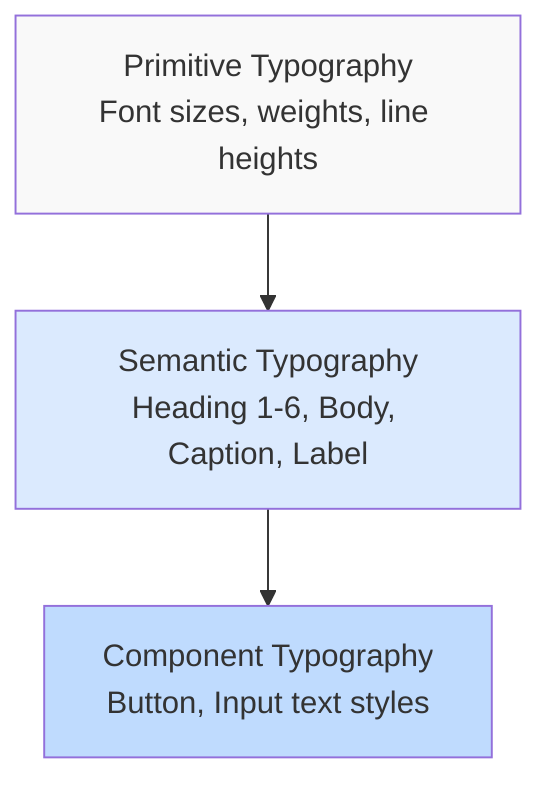

# Typography System Documentation

**Lufa Design System v2.0**  
**Package**: `@grasdouble/lufa_design-system-tokens`

---

## Overview

The Lufa Design System uses a comprehensive typography system with fluid font sizes, modular scale, and semantic hierarchy. The system includes font families, sizes, weights, line heights, and letter spacing.

---

## Typography Architecture



---

## Font Size Scale (Level 1)

The system uses a modular scale with fluid typography for responsive design.

### Visual Font Size Scale

```
┌────────────────────────────────────────────────────────────────┐
│ Token    Value           Visual Example                         │
├────────────────────────────────────────────────────────────────┤
│ xs       12px            Small text                             │
│ sm       14px            Slightly larger                         │
│ base     16px            Standard body text                      │
│ lg       18px            Emphasized text                         │
│ xl       20px            Subtitle text                           │
│ 2xl      20-24px         Heading Level 4                         │
│ 3xl      24-30px         Heading Level 3                         │
│ 4xl      28-36px         Heading Level 2                         │
│ 5xl      32-48px         Heading Level 1 / Hero                  │
│ 6xl      40-60px         Hero Headlines                          │
│ 7xl      48-72px         Marketing Hero                          │
│ 8xl      64-96px         Display / Impact Text                   │
└────────────────────────────────────────────────────────────────┘
```

---

## Font Sizes in Detail

### xs - Extra Small (12px)

**Visual Size**: <span style="font-size: 12px">The quick brown fox</span>

**CSS Variable**: `--lufa-primitive-typography-font-size-xs`

**Use Cases**:

- Secondary labels
- Timestamps
- Footnotes
- Metadata

**Example**:

```css
.timestamp {
  font-size: var(--lufa-primitive-typography-font-size-xs);
  color: var(--lufa-semantic-ui-text-tertiary);
}
```

---

### sm - Small (14px)

**Visual Size**: <span style="font-size: 14px">The quick brown fox</span>

**CSS Variable**: `--lufa-primitive-typography-font-size-sm`

**Use Cases**:

- Secondary text
- Short descriptions
- Captions
- Helper text

**Example**:

```css
.description {
  font-size: var(--lufa-primitive-typography-font-size-sm);
  color: var(--lufa-semantic-ui-text-secondary);
}
```

---

### base - Base (16px)

**Visual Size**: <span style="font-size: 16px">The quick brown fox</span>

**CSS Variable**: `--lufa-primitive-typography-font-size-base`

**Use Cases**:

- Body text (default)
- Standard paragraphs
- Input fields
- Buttons

**Example**:

```css
body {
  font-size: var(--lufa-primitive-typography-font-size-base);
}

.button {
  font-size: var(--lufa-primitive-typography-font-size-base);
}
```

---

### lg - Large (18px)

**Visual Size**: <span style="font-size: 18px">The quick brown fox</span>

**CSS Variable**: `--lufa-primitive-typography-font-size-lg`

**Use Cases**:

- Emphasized text
- Lead paragraphs
- H6 headings

**Example**:

```css
.lead {
  font-size: var(--lufa-primitive-typography-font-size-lg);
  font-weight: var(--lufa-primitive-typography-font-weight-medium);
}

h6 {
  font-size: var(--lufa-primitive-typography-font-size-lg);
}
```

---

### xl - Extra Large (20px)

**Visual Size**: <span style="font-size: 20px">The quick brown fox</span>

**CSS Variable**: `--lufa-primitive-typography-font-size-xl`

**Use Cases**:

- Subtitles
- H5 headings
- Large labels

**Example**:

```css
h5 {
  font-size: var(--lufa-primitive-typography-font-size-xl);
  font-weight: var(--lufa-primitive-typography-font-weight-semibold);
}
```

---

### 2xl - 2X Extra Large (20-24px, Fluid)

**Visual Size**: <span style="font-size: clamp(20px, 1rem + 1vw, 24px)">The quick brown fox</span>

**CSS Variable**: `--lufa-primitive-typography-font-size-2xl`

**Fluid Value**: `clamp(1.25rem, 1rem + 1vw, 1.5rem)`  
**Range**: 20px (mobile) → 24px (desktop)

**Use Cases**:

- H4 headings
- Card titles
- Section subtitles

**Example**:

```css
h4 {
  font-size: var(--lufa-primitive-typography-font-size-2xl);
  font-weight: var(--lufa-primitive-typography-font-weight-semibold);
}
```

---

### 3xl - 3X Extra Large (24-30px, Fluid)

**Visual Size**: <span style="font-size: clamp(24px, 1.25rem + 1vw, 30px)">The quick brown fox</span>

**CSS Variable**: `--lufa-primitive-typography-font-size-3xl`

**Fluid Value**: `clamp(1.5rem, 1.25rem + 1vw, 1.875rem)`  
**Range**: 24px (mobile) → 30px (desktop)

**Use Cases**:

- H3 headings
- Subsection titles

**Example**:

```css
h3 {
  font-size: var(--lufa-primitive-typography-font-size-3xl);
  font-weight: var(--lufa-primitive-typography-font-weight-semibold);
}
```

---

### 4xl - 4X Extra Large (28-36px, Fluid)

**Visual Size**: <span style="font-size: clamp(28px, 1.5rem + 1.25vw, 36px)">The quick brown fox</span>

**CSS Variable**: `--lufa-primitive-typography-font-size-4xl`

**Fluid Value**: `clamp(1.75rem, 1.5rem + 1.25vw, 2.25rem)`  
**Range**: 28px (mobile) → 36px (desktop)

**Use Cases**:

- H2 headings
- Major section titles

**Example**:

```css
h2 {
  font-size: var(--lufa-primitive-typography-font-size-4xl);
  font-weight: var(--lufa-primitive-typography-font-weight-bold);
}
```

---

### 5xl - 5X Extra Large (32-48px, Fluid)

**Visual Size**: <span style="font-size: clamp(32px, 1.5rem + 2vw, 48px)">The quick brown fox</span>

**CSS Variable**: `--lufa-primitive-typography-font-size-5xl`

**Fluid Value**: `clamp(2rem, 1.5rem + 2vw, 3rem)`  
**Range**: 32px (mobile) → 48px (desktop)

**Use Cases**:

- H1 headings
- Page titles
- Hero titles

**Example**:

```css
h1 {
  font-size: var(--lufa-primitive-typography-font-size-5xl);
  font-weight: var(--lufa-primitive-typography-font-weight-bold);
}

.hero-title {
  font-size: var(--lufa-primitive-typography-font-size-5xl);
}
```

---

### 6xl - 6X Extra Large (40-60px, Fluid)

**Visual Size**: <span style="font-size: clamp(40px, 2rem + 2.5vw, 60px)">The quick brown fox</span>

**CSS Variable**: `--lufa-primitive-typography-font-size-6xl`

**Fluid Value**: `clamp(2.5rem, 2rem + 2.5vw, 3.75rem)`  
**Range**: 40px (mobile) → 60px (desktop)

**Use Cases**:

- Hero headlines
- Featured content
- Large page titles

**Example**:

```css
.hero-headline {
  font-size: var(--lufa-primitive-typography-font-size-6xl);
  font-weight: var(--lufa-primitive-typography-font-weight-bold);
  letter-spacing: var(--lufa-primitive-typography-letter-spacing-tight);
}
```

---

### 7xl - 7X Extra Large (48-72px, Fluid)

**Visual Size**: <span style="font-size: clamp(48px, 2.5rem + 3vw, 72px)">The quick brown fox</span>

**CSS Variable**: `--lufa-primitive-typography-font-size-7xl`

**Fluid Value**: `clamp(3rem, 2.5rem + 3vw, 4.5rem)`  
**Range**: 48px (mobile) → 72px (desktop)

**Use Cases**:

- Marketing hero sections
- Landing page headlines
- Large announcements

**Example**:

```css
.marketing-hero {
  font-size: var(--lufa-primitive-typography-font-size-7xl);
  font-weight: var(--lufa-primitive-typography-font-weight-bold);
  letter-spacing: var(--lufa-primitive-typography-letter-spacing-tighter);
}
```

---

### 8xl - 8X Extra Large (64-96px, Fluid)

**Visual Size**: <span style="font-size: clamp(64px, 3rem + 4vw, 96px)">The quick brown fox</span>

**CSS Variable**: `--lufa-primitive-typography-font-size-8xl`

**Fluid Value**: `clamp(4rem, 3rem + 4vw, 6rem)`  
**Range**: 64px (mobile) → 96px (desktop)

**Use Cases**:

- Display text
- Brand impact moments
- Decorative large text

**Example**:

```css
.display-text {
  font-size: var(--lufa-primitive-typography-font-size-8xl);
  font-weight: var(--lufa-primitive-typography-font-weight-bold);
  letter-spacing: var(--lufa-primitive-typography-letter-spacing-tighter);
}
```

---

## Font Weights

### Visual Weight Scale

```
┌─────────────────────────────────────────────────────┐
│ Token     Value   Visual Example                     │
├─────────────────────────────────────────────────────┤
│ normal    400     Normal weight text                 │
│ medium    500     Medium weight text                 │
│ semibold  600     Semibold weight text               │
│ bold      700     Bold weight text                   │
└─────────────────────────────────────────────────────┘
```

### normal - Normal (400)

**CSS Variable**: `--lufa-primitive-typography-font-weight-normal`

**Use Cases**: Body text, paragraphs, descriptions

**Example**:

```css
p {
  font-weight: var(--lufa-primitive-typography-font-weight-normal);
}
```

---

### medium - Medium (500)

**CSS Variable**: `--lufa-primitive-typography-font-weight-medium`

**Use Cases**: Labels, navigation, light emphasis

**Example**:

```css
.label {
  font-weight: var(--lufa-primitive-typography-font-weight-medium);
}
```

---

### semibold - Semibold (600)

**CSS Variable**: `--lufa-primitive-typography-font-weight-semibold`

**Use Cases**: Subtitles, buttons, strong emphasis

**Example**:

```css
.button {
  font-weight: var(--lufa-primitive-typography-font-weight-semibold);
}

h3,
h4,
h5 {
  font-weight: var(--lufa-primitive-typography-font-weight-semibold);
}
```

---

### bold - Bold (700)

**CSS Variable**: `--lufa-primitive-typography-font-weight-bold`

**Use Cases**: Headings, critical interface elements

**Example**:

```css
h1,
h2 {
  font-weight: var(--lufa-primitive-typography-font-weight-bold);
}

.alert-title {
  font-weight: var(--lufa-primitive-typography-font-weight-bold);
}
```

---

## Line Heights

### Visual Line Height Examples

```
┌──────────────────────────────────────────────────────┐
│ tight (1.25)    - Headings, compact text             │
│ normal (1.5)    - Body text (WCAG recommended)       │
│ relaxed (1.75)  - Long-form content                  │
└──────────────────────────────────────────────────────┘
```

### tight - Tight (1.25)

**CSS Variable**: `--lufa-primitive-typography-line-height-tight`

**Use Cases**: Headings, compact interface text

**Example**:

```css
h1,
h2,
h3,
h4,
h5,
h6 {
  line-height: var(--lufa-primitive-typography-line-height-tight);
}
```

---

### normal - Normal (1.5)

**CSS Variable**: `--lufa-primitive-typography-line-height-normal`

**Use Cases**: Body text, paragraphs (WCAG recommended)

**Example**:

```css
body,
p {
  line-height: var(--lufa-primitive-typography-line-height-normal);
}
```

---

### relaxed - Relaxed (1.75)

**CSS Variable**: `--lufa-primitive-typography-line-height-relaxed`

**Use Cases**: Long articles, documentation

**Example**:

```css
.article-content {
  line-height: var(--lufa-primitive-typography-line-height-relaxed);
}
```

---

## Letter Spacing

### Visual Letter Spacing Examples

```
┌──────────────────────────────────────────────────────┐
│ tighter (-0.04em) - Very large headings              │
│ tight (-0.02em)   - Large headings                   │
│ normal (0)        - Body text                        │
│ wide (0.05em)     - Small text, uppercase labels     │
│ wider (0.1em)     - All-caps headings                │
└──────────────────────────────────────────────────────┘
```

### tighter - Extra Tight (-0.04em)

**CSS Variable**: `--lufa-primitive-typography-letter-spacing-tighter`

**Use Cases**: Display text, hero headings (6xl-8xl)

**Example**:

```css
.display-text {
  font-size: var(--lufa-primitive-typography-font-size-7xl);
  letter-spacing: var(--lufa-primitive-typography-letter-spacing-tighter);
}
```

---

### tight - Tight (-0.02em)

**CSS Variable**: `--lufa-primitive-typography-letter-spacing-tight`

**Use Cases**: Large headings (H1-H3, 3xl-5xl)

**Example**:

```css
h1,
h2,
h3 {
  letter-spacing: var(--lufa-primitive-typography-letter-spacing-tight);
}
```

---

### normal - Normal (0)

**CSS Variable**: `--lufa-primitive-typography-letter-spacing-normal`

**Use Cases**: Body text, paragraphs, standard content

**Example**:

```css
body,
p {
  letter-spacing: var(--lufa-primitive-typography-letter-spacing-normal);
}
```

---

### wide - Wide (0.05em)

**CSS Variable**: `--lufa-primitive-typography-letter-spacing-wide`

**Use Cases**: Small text, captions, uppercase labels (xs-sm)

**Example**:

```css
.caption,
.label-uppercase {
  font-size: var(--lufa-primitive-typography-font-size-xs);
  letter-spacing: var(--lufa-primitive-typography-letter-spacing-wide);
  text-transform: uppercase;
}
```

---

### wider - Extra Wide (0.1em)

**CSS Variable**: `--lufa-primitive-typography-letter-spacing-wider`

**Use Cases**: All-caps headings, button text (uppercase)

**Example**:

```css
.section-label {
  font-size: var(--lufa-primitive-typography-font-size-sm);
  letter-spacing: var(--lufa-primitive-typography-letter-spacing-wider);
  text-transform: uppercase;
  font-weight: var(--lufa-primitive-typography-font-weight-semibold);
}
```

---

## Semantic Typography (Level 3)

Semantic tokens provide contextual hierarchy.

### Heading Hierarchy

| Token       | Font Size       | Font Weight      | Line Height    | Use Case           |
| ----------- | --------------- | ---------------- | -------------- | ------------------ |
| `heading.1` | `5xl` (32-48px) | `bold` (700)     | `tight` (1.25) | H1, page titles    |
| `heading.2` | `4xl` (28-36px) | `bold` (700)     | `tight` (1.25) | H2, major sections |
| `heading.3` | `3xl` (24-30px) | `semibold` (600) | `tight` (1.25) | H3, subsections    |
| `heading.4` | `2xl` (20-24px) | `semibold` (600) | `tight` (1.25) | H4, card titles    |
| `heading.5` | `xl` (20px)     | `semibold` (600) | `tight` (1.25) | H5, list titles    |
| `heading.6` | `lg` (18px)     | `semibold` (600) | `tight` (1.25) | H6, inline titles  |

**Example**:

```css
h1 {
  font-size: var(--lufa-semantic-typography-heading-1);
  font-weight: var(--lufa-primitive-typography-font-weight-bold);
  line-height: var(--lufa-primitive-typography-line-height-tight);
}

h2 {
  font-size: var(--lufa-semantic-typography-heading-2);
  font-weight: var(--lufa-primitive-typography-font-weight-bold);
  line-height: var(--lufa-primitive-typography-line-height-tight);
}
```

---

### Body Text Hierarchy

| Token          | Font Size     | Font Weight    | Line Height    | Use Case           |
| -------------- | ------------- | -------------- | -------------- | ------------------ |
| `body.large`   | `lg` (18px)   | `normal` (400) | `normal` (1.5) | Lead paragraphs    |
| `body.default` | `base` (16px) | `normal` (400) | `normal` (1.5) | Standard body text |
| `body.small`   | `sm` (14px)   | `normal` (400) | `normal` (1.5) | Secondary content  |

**Example**:

```css
.lead {
  font-size: var(--lufa-semantic-typography-body-large);
}

p {
  font-size: var(--lufa-semantic-typography-body-default);
}

.description {
  font-size: var(--lufa-semantic-typography-body-small);
}
```

---

### UI Text

| Token     | Font Size     | Font Weight      | Use Case                      |
| --------- | ------------- | ---------------- | ----------------------------- |
| `caption` | `xs` (12px)   | `normal` (400)   | Captions, footnotes, metadata |
| `label`   | `sm` (14px)   | `medium` (500)   | Form labels, UI labels        |
| `button`  | `base` (16px) | `semibold` (600) | Button text, CTAs             |

**Example**:

```css
.caption {
  font-size: var(--lufa-semantic-typography-caption);
}

label {
  font-size: var(--lufa-semantic-typography-label);
  font-weight: var(--lufa-primitive-typography-font-weight-medium);
}

.button {
  font-size: var(--lufa-semantic-typography-button);
  font-weight: var(--lufa-primitive-typography-font-weight-semibold);
}
```

---

## Typography Patterns

### Complete Heading System

```css
h1 {
  font-size: var(--lufa-semantic-typography-heading-1);
  font-weight: var(--lufa-primitive-typography-font-weight-bold);
  line-height: var(--lufa-primitive-typography-line-height-tight);
  letter-spacing: var(--lufa-primitive-typography-letter-spacing-tight);
  margin-bottom: var(--lufa-primitive-spacing-24);
}

h2 {
  font-size: var(--lufa-semantic-typography-heading-2);
  font-weight: var(--lufa-primitive-typography-font-weight-bold);
  line-height: var(--lufa-primitive-typography-line-height-tight);
  letter-spacing: var(--lufa-primitive-typography-letter-spacing-tight);
  margin-bottom: var(--lufa-primitive-spacing-16);
}

h3 {
  font-size: var(--lufa-semantic-typography-heading-3);
  font-weight: var(--lufa-primitive-typography-font-weight-semibold);
  line-height: var(--lufa-primitive-typography-line-height-tight);
  margin-bottom: var(--lufa-primitive-spacing-12);
}

h4 {
  font-size: var(--lufa-semantic-typography-heading-4);
  font-weight: var(--lufa-primitive-typography-font-weight-semibold);
  line-height: var(--lufa-primitive-typography-line-height-tight);
  margin-bottom: var(--lufa-primitive-spacing-12);
}

h5,
h6 {
  font-size: var(--lufa-semantic-typography-heading-5);
  font-weight: var(--lufa-primitive-typography-font-weight-semibold);
  line-height: var(--lufa-primitive-typography-line-height-tight);
  margin-bottom: var(--lufa-primitive-spacing-8);
}
```

---

### Body Text System

```css
body {
  font-family: var(--lufa-primitive-typography-font-family-sans);
  font-size: var(--lufa-semantic-typography-body-default);
  font-weight: var(--lufa-primitive-typography-font-weight-normal);
  line-height: var(--lufa-primitive-typography-line-height-normal);
  letter-spacing: var(--lufa-primitive-typography-letter-spacing-normal);
}

p {
  margin-bottom: var(--lufa-primitive-spacing-16);
}

.lead {
  font-size: var(--lufa-semantic-typography-body-large);
  font-weight: var(--lufa-primitive-typography-font-weight-medium);
  margin-bottom: var(--lufa-primitive-spacing-24);
}

.small-text {
  font-size: var(--lufa-semantic-typography-body-small);
}

.caption {
  font-size: var(--lufa-semantic-typography-caption);
  color: var(--lufa-semantic-ui-text-tertiary);
}
```

---

## Accessibility Guidelines

### WCAG 1.4.12 - Text Spacing

Ensure adequate text spacing for readability:

```css
* {
  /* Line height at least 1.5x font size */
  line-height: var(--lufa-primitive-typography-line-height-normal);

  /* Paragraph spacing at least 2x font size */
  margin-bottom: calc(var(--lufa-semantic-typography-body-default) * 2);
}

p {
  /* Letter spacing at least 0.12x font size */
  letter-spacing: var(--lufa-primitive-typography-letter-spacing-normal);

  /* Word spacing at least 0.16x font size */
  word-spacing: 0.16em;
}
```

---

### Minimum Font Sizes

For accessibility, avoid font sizes smaller than 12px for body text:

- **Minimum**: 12px (use only for captions, metadata)
- **Recommended**: 16px for body text
- **Large text**: 18px+ or 14px+ bold

---

## Quick Reference

### Most Common Typography Tokens

| Use Case           | Token          | Value           |
| ------------------ | -------------- | --------------- |
| Page title (H1)    | `heading.1`    | 32-48px (fluid) |
| Section title (H2) | `heading.2`    | 28-36px (fluid) |
| Subsection (H3)    | `heading.3`    | 24-30px (fluid) |
| Body text          | `body.default` | 16px            |
| Lead paragraph     | `body.large`   | 18px            |
| Small text         | `body.small`   | 14px            |
| Caption            | `caption`      | 12px            |
| Label              | `label`        | 14px            |
| Button             | `button`       | 16px            |

---

### Font Weight Usage

| Weight   | Value | Use Cases             |
| -------- | ----- | --------------------- |
| Normal   | 400   | Body text, paragraphs |
| Medium   | 500   | Labels, navigation    |
| Semibold | 600   | Buttons, H3-H6        |
| Bold     | 700   | H1-H2, emphasis       |

---

**Last Updated**: February 2026  
**Version**: 2.0.0  
**Status**: ✅ Complete
